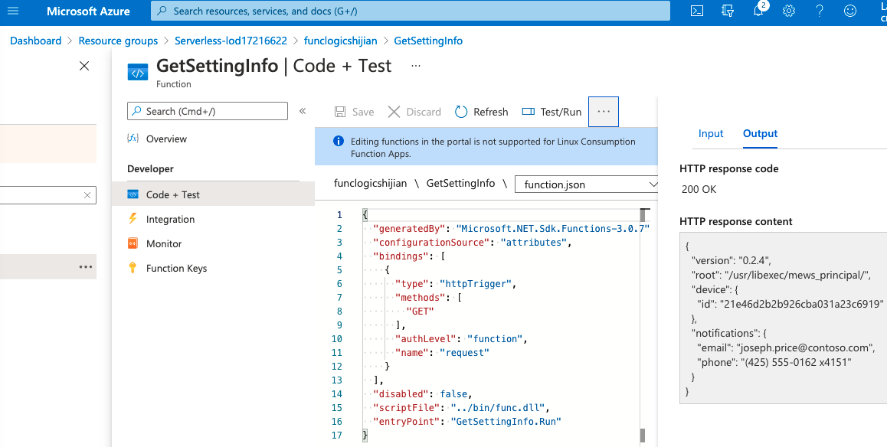

- (1) Create a Storage account
  - All service -> Storage Accounts -> New
    - Basics
      - Resource group -> Create new -> `Serverless`
      - Name: funcstorshijian
      - Location: (US) East US
      - Performance: Standard
      - Account kind: StorageV2(general purpose v2)
      - Replication: Locally-redundant storage (LRS)
  - Review + Create -> Create
  - Once the resource is deployed -> Go to resource
  - Access keys
    - `Key`: `hidden`
    - `Connection string`: `hidden`
- (2) Create a Function app
  - All service -> Function App -> New
    - Basics
      - Resource group: `Serverless`
      - Name: funclogicshijian
      - Publish: Code
      - Runtime stack: .NET
      - Version: 3.1
      - Region: East US
    - Next -> Hosting
      - Storage account: funcstorshijian
      - Operating System: Linux
      - Plan type: Consumption (Serverless)
  - Review + Create -> Create
- (3) Configure a local Azure Functions project

```bash
# cd Solutions

mkdir func && cd func

# had installed Azure Functions Core Tools
func init --worker-runtime dotnet --force

# open the local.settings.json file.
# Observe the current value of the AzureWebJobsStorage setting
# "AzureWebJobsStorage": "UseDevelopmentStorage=true",
Update the value of the AzureWebJobsStorage by setting it to the connection string of the storage account that you recorded earlier in this lab.

dotnet build

# ----------

func new --template "HTTP trigger" --name "Echo" # an Open API
# write Echo.cs

func start --build

httprepl http://localhost:7071
(Disconnected)> connect http://localhost:7071
Using a base address of http://localhost:7071/
Unable to find an OpenAPI description
For detailed tool info, see https://aka.ms/http-repl-doc

http://localhost:7071/> cd api
http://localhost:7071/api>

http://localhost:7071/api> cd echo
http://localhost:7071/api/echo>

http://localhost:7071/api/echo> post --content 3
HTTP/1.1 200 OK
Date: Mon, 24 May 2021 12:34:38 GMT
Server: Kestrel
Transfer-Encoding: chunked

3

post --content 5
post --content "Hello"
post --content "{"msg": "Successful"}"
exit

# ----------

func new --template "Timer trigger" --name "Recurring" # A scheduler
# write Recurring.cs

func start --build
For detailed output, run func with --verbose flag.
[2021-05-24T12:40:30.149Z] Executing 'Recurring' (Reason='Timer fired at 2021-05-24T20:40:30.0536290+08:00', Id=c3db5f9d-cdaf-42c5-96c0-bac4887a38a4)
[2021-05-24T12:40:30.165Z] C# Timer trigger function executed at: 5/24/2021 8:40:30 PM
[2021-05-24T12:40:30.187Z] Executed 'Recurring' (Succeeded, Id=c3db5f9d-cdaf-42c5-96c0-bac4887a38a4, Duration=124ms)
[2021-05-24T12:40:33.851Z] Host lock lease acquired by instance ID '000000000000000000000000000C317A'.
[2021-05-24T12:41:00.004Z] Executing 'Recurring' (Reason='Timer fired at 2021-05-24T20:41:00.0015640+08:00', Id=4bd516df-ad29-46c8-b842-9b87d23d7307)
[2021-05-24T12:41:00.006Z] C# Timer trigger function executed at: 5/24/2021 8:41:00 PM
[2021-05-24T12:41:00.011Z] Executed 'Recurring' (Succeeded, Id=4bd516df-ad29-46c8-b842-9b87d23d7307, Duration=5ms)
```

- (4) Create a function that integrates with other services
  - Upload sample content to Azure Blob Storage
    - Resource groups -> find the Serverless just now create
    - Select the Storage account `funcstorshijian` -> Container -> + Container
      - Name: content
      - Public access level: Private (no anonymous access)
      - -> Create
    - content -> Upload -> `Solutions/settings.json` in this lab -> Overwrite if files already exist -> Upload
- (5) Create a HTTP-triggered function

```bash
# cd Solutions/func

func new --template "HTTP trigger" --name "GetSettingInfo"
# write GetSettingInfo.cs
func extensions install --package Microsoft.Azure.WebJobs.Extensions.Storage --version 4.0.4
dotnet build

func start --build

httprepl http://localhost:7071
http://localhost:7071/> cd api

http://localhost:7071/api> cd getsettinginfo

http://localhost:7071/api/getsettinginfo> get
HTTP/1.1 200 OK
Content-Type: text/plain; charset=utf-8
Date: Mon, 24 May 2021 12:56:41 GMT
Server: Kestrel
Transfer-Encoding: chunked

{
    "version": "0.2.4",
    "root": "/usr/libexec/mews_principal/",
    "device": {
        "id": "21e46d2b2b926cba031a23c6919"
    },
    "notifications": {
        "email": "joseph.price@contoso.com",
        "phone": "(425) 555-0162 x4151"
    }
}

exit
```

- (6) Deploy a local function project to an Azure Functions app

```bash
az login
func azure functionapp publish funclogicshijian
```

- (7) Validate deployment
  - Resource groups -> Serverless -> funclogicshijian
  - -> Functions -> Search `GetSettingInfo` (take a bit time even after the Terminal said uploaded)
  - -> Click inside -> Code + Test -> In the function editor, select Test/Run (on the right top)
  - in the popup dialog
    - In the HTTP method list, select GET
    - Select Run to test the function



```text
HTTP response code
200 OK
HTTP response content
{
  "version": "0.2.4",
  "root": "/usr/libexec/mews_principal/",
  "device": {
    "id": "21e46d2b2b926cba031a23c6919"
  },
  "notifications": {
    "email": "joseph.price@contoso.com",
    "phone": "(425) 555-0162 x4151"
  }
}
```

- (8) Clean up your subscription

```bash
az group delete --name Serverless --no-wait --yes
```

```text
Module 2 Review Questions
Question 1
Which of the following plans for Functions automatically add compute power, if needed, when your code is running.
Consumption Plan
Premium Plan
Both Consumption and Premium plans automatically add compute power when your code is running. Your app is scaled out when needed to handle load, and scaled down when code stops running.

Question 2
Only Functions running in the consumption plan require a general Azure Storage account.
False
On any plan, a function app requires a general Azure Storage account, which supports Azure Blob, Queue, Files, and Table storage.

Question 3
You created a Function in the Azure Portal. Which of the following statements regarding the direction property of the triggers, or bindings, are valid?
For triggers, the direction is always
Input and output bindings can use
Some bindings can use
All triggers and bindings have a direction property in the function.json file.

Question 4
Azure Functions uses a component called the scale controller to monitor the rate of events and determine whether to scale out or scale in. Is the following statement True or False? When you're using an Azure Queue storage trigger, it scales based on the queue length and the age of the newest queue message.
False
When using an Azure Queue storage trigger, it scales based on the queue length and the age of the oldest queue message.

Question 5
Which of the below are valid application patterns that can benefit from durable functions?
Function chaining
Fan-out/fan-in
Async HTTP APIs
Function chaining, Fan-out/fan-in, and Async HTTP APIs are application patterns that can benefit from Durable Functions.
```
