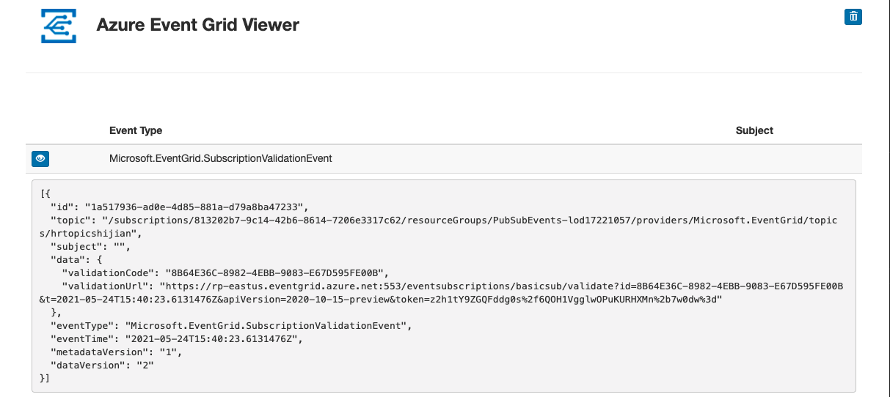
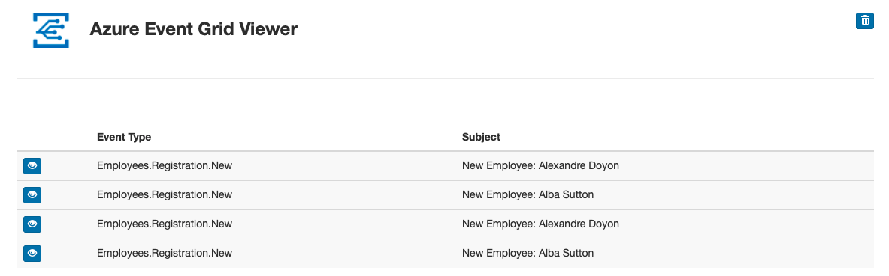

- (1) Preparation

```bash
az --version
az provider --help
az provider list
az provider list --query "[].namespace" | grep Microsoft.EventGrid
```

- (2) Create a custom Event Grid topic
  - Create a resource -> New -> Event Grid Topic
    - Resource group: PubSubEvents
    - Name: hrtopicshijian
    - Advanced -> Event Schema: Event Grid Schema
    - -> Create
- (3) Deploy the Azure Event Grid viewer to a web app
  - Create a resource -> New -> Web App
    - Resource group: PubSubEvents
    - Name: eventviewershijian
    - Publish: Docker Container
    - Operating System: Linux
    - Region: East US
    - Linux Plan (East US) section: Create new
      - Name: EventPlan
      - SKU and size keep as default
    - Next: Docker
      - Option: Single Container
      - Image Source: Docker Hub
      - Access Type: Public
      - Image and tag: microsoftlearning/azure-event-grid-viewer:latest
      - -> Review + Create
  - Once the resource is deployed -> Go to resource
  - URL: `https://eventviewershijian.azurewebsites.net`
  - Browse
- (4) Create new subscription
  - Resource groups -> PubSubEvents -> hrtopicshijian
  - + Event Subscription
    - Name: basicsub
    - Event Schema: Event Grid Schema
    - Endpoint Type: Web Hook
    - Endpoint: In the Select Web Hook dialog box, in the Subscriber Endpoint text box, enter the Web App URL value that you recorded earlier, ensure it uses an https:// prefix, add the suffix /api/updates, and then select Confirm Selection. -> `https://eventviewershijian.azurewebsites.net/api/updates`

> Note: For example, if your Web App URL value is http://eventviewerstudent.azurewebsites.net/, then your Subscriber Endpoint would be https://eventviewerstudent.azurewebsites.net/api/updates.

- (5) Observe the subscription validation event

```bash
open https://eventviewershijian.azurewebsites.net/
```



- (6) Record subscription credentials
  - Resource groups -> PubSubEvents -> hrtopicshijian
  - Overview -> Topic Endpoint: `https://hrtopicshijian.eastus-1.eventgrid.azure.net/api/events`
  - Access keys
    - `Key`: `hidden`

- (7) Publish Event Grid events from .NET

```bash
# Create project
# cd Solutions/EventPublisher
dotnet new console --name EventPublisher --output . # new .NET project
dotnet add package Microsoft.Azure.EventGrid --version 3.2.0
dotnet build

# write Program.cs
# // Update Event Grid Topic Endpoint
# private const string topicEndpoint = "https://hrtopicshijian.eastus-1.eventgrid.azure.net/api/events";
# // Update Event Grid Topic Access Key
# private const string topicKey = "<<key>>

open http://eventviewerstudent.azurewebsites.net/
dotnet run # will publish events
```



```bash
# Clean Azure resource
az login
az group list
[
  {
    "id": "/subscriptions/4a38dcc5-0150-4aa9-ad87-0c4dc5f55fcc/resourceGroups/PubSubEvents-lod14656051",
    "location": "westus",
    "managedBy": null,
    "name": "PubSubEvents-lod14656051",
    "properties": {
      "provisioningState": "Succeeded"
    },
    "tags": {
      "LODManaged": "lod",
      "LabInstance": "14656051",
      "LabProfile": "69289",
      "TS": "132514500690657543"
    },
    "type": "Microsoft.Resources/resourceGroups"
  }
]
AZURE_GROUP_NAME=$(az group list --query '[0].name' -o json | jq -r) # "jq -r" to unwrap the "" for the string
echo ${AZURE_GROUP_NAME}
az group delete --name ${AZURE_GROUP_NAME} --no-wait --yes
```

```text
Module 9 Review Questions
Question 1
Regarding Azure Event Grid, which of the below represents the smallest amount of information that fully describes something happening in the system?
Events
An event is the smallest amount of information that fully describes something that happened in the system. Every event has common information like: source of the event, time the event took place, and unique identifier.

Question 2
Azure Event Grid has three types of authentication. Select the valid types of authentication from the list below.
Custom topic publishing
Event subscription
WebHook event delivery
Azure Event Grid has three types of authentication; Custom topic publishing, Event subscription, and WebHook event delivery.

Question 3
Azure Event Hubs is a big data streaming platform and event ingestion service. What type of service is it?
PaaS
Event Hubs is a fully managed Platform-as-a-Service (PaaS) with little configuration or management overhead.

Question 4
In .NET programming which of the below is the primary class for interacting with Event Hubs?
Microsoft.Azure.EventHubs.EventHubClient
The primary class for interacting with Event Hubs is Microsoft.Azure.EventHubs.EventHubClient. You can instantiate this class using the CreateFromConnectionString method.
```
