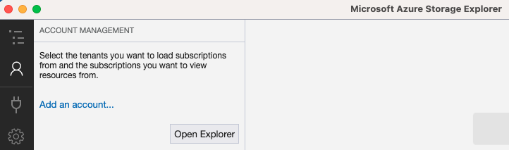
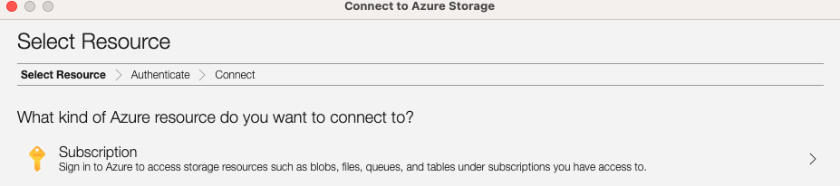
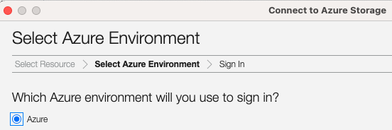
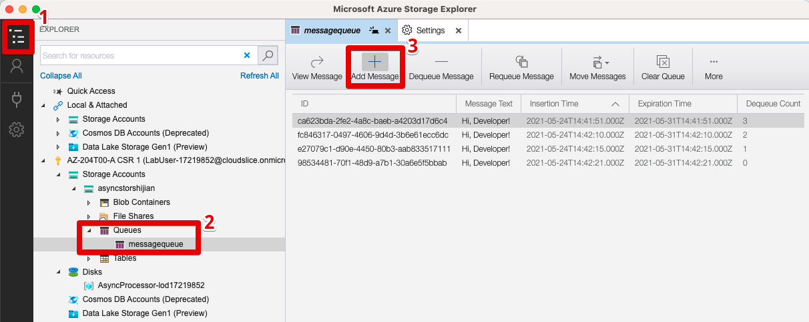

- (1) Create a Storage account
  - All service -> Storage Accounts -> New
    - Basics
      - Resource group: `AsyncProcessor`
      - Name: asyncstorshijian
      - Location: (US) East US
      - Performance: Standard
      - Account kind: StorageV2(general purpose v2)
      - Replication: Locally-redundant storage (LRS)
  - Review + Create -> Create
  - Once the resource is deployed -> Go to resource
  - Access keys
    - `Key`: `hidden`
    - `Connection string`: `hidden`
- (2) Configure the Azure Storage SDK

```bash
# Create project
# cd Solutions/MessageProcessor
dotnet new console --name MessageProcessor --output . # new .NET project
dotnet add package Azure.Storage.Queues --version 12.0.0
dotnet build

# write Program.cs
    private const string storageConnectionString = "<storage-connection-string>";
    private const string queueName = "messagequeue";
# to
    private const string storageConnectionString = "DefaultEndpointsProtocol=https;AccountName=asyncstorshijian;AccountKey=scVuRGSus/ArN0FusslyT1OkWYQd8Jc9vI4Az6WLk7r0fkj+z5Mbm/BkhuMMz0Zw1ezs4LftwCOgD1mmtNCi2A==;EndpointSuffix=core.windows.net";
    private const string queueName = "messagequeue";

dotnet build

# Validate Azure Storage access
dotnet run # will print out below
# ---Account Metadata---
# Account Uri:	https://asyncstorshijian.queue.core.windows.net/messagequeue

# Modify Program.cs - read message
dotnet run
# Azure Portal -> Storage Account -> Storage Explorer -> QUEUES -> messagequeue manual add the message
dotnet run # print the message

# Modify Program.cs - delete message
dotnet run # print and delete, the portal cannot see the message

# Modify Program.cs - send message
dotnet run
```

- (3) Test message queue access
  - Resource groups -> AsyncProcessor -> asyncstorshijian
  - Overview -> Open in Explorer (on the right top)
  - Need to install `Azure Storage Explorer` (as 20210524) -> Sign in
    - EXPLORER panel -> asyncstorshijian -> expand the Queues node
    - Open the messagequeue queue that created earlier by using .NET code
    - Add Message
      - In the Message text text box, enter the value Hello World.
      - In the Expires in text box, enter the value 12.
      - In the Expires in drop-down list, select Hours.
      - Ensure that the Encode message body in Base 64 check box isn't selected.
      - OK

Login to the Azure account







Where are the resources



```bash
dotnet run
```

- (4) Clean up your subscription

```bash
az login
AZURE_GROUP_NAME=$(az group list --query '[0].name' -o json | jq -r) # "jq -r" to unwrap the "" for the string
echo ${AZURE_GROUP_NAME}
az group delete --name ${AZURE_GROUP_NAME} --no-wait --yes
```

```text
Module 10 Review Questions
Question 1
Which of the following advanced features of Azure Service Bus is used to guarantee a first-in, first-out (FIFO) guarantee?
Select one
Transactions
Scheduled delivery
Message sessions
None of the above

Question 2
In Azure Service Bus which of the following receive modes is best for scenarios in which the application can tolerate not processing a message if a failure occurs?
ReceiveAndDelete
ReceiveAndDelete mode is the simplest model and works best for scenarios in which the application can tolerate not processing a message if a failure occurs.

Question 3
In Azure Queue storage, what is the default time time-to-live for a message?
7 days
The default time that a message can remain in the queue is seven days.

Question 4
In Azure Queue storage, which two methods below are used to de-queue a message?
GetMessage
DeleteMessage
Your code de-queues a message from a queue in two steps. When you call GetMessage, you get the next message in a queue. A message returned from GetMessage becomes invisible to any other code reading messages from this queue. By default, this message stays invisible for 30 seconds. To finish removing the message from the queue, you must also call DeleteMessage.
```
